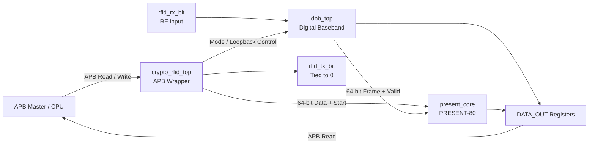
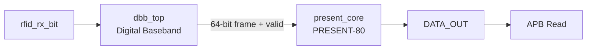

# RFID Baseband & Cryptographic Subsystem

An RTL implementation of an **RFID Digital Baseband (DBB) and PRESENT-80 cryptographic subsystem** integrated through an **APB slave wrapper**. The subsystem supports a live RFID receive path, DBB loopback validation, and cryptographic loopback operation, with the current design targeting **ISO/IEC 14443A Type A, 106 kbit/s Manchester reception** and a **50 MHz system clock**.

> **Project Status:** RTL architecture and implementation completed. Constraint definition, synthesis, physical design, signoff, and GDSII generation are planned as the next stages.

---

## Table of Contents

- [Project Overview](https://chatgpt.com/c/6abe3140-96ac-83e9-9ff8-9793669ea69c#project-overview)
- [Key Features](https://chatgpt.com/c/6abe3140-96ac-83e9-9ff8-9793669ea69c#key-features)
- [System Architecture](https://chatgpt.com/c/6abe3140-96ac-83e9-9ff8-9793669ea69c#system-architecture)
- [Operating Modes](https://chatgpt.com/c/6abe3140-96ac-83e9-9ff8-9793669ea69c#operating-modes)
- [RTL Hierarchy](https://chatgpt.com/c/6abe3140-96ac-83e9-9ff8-9793669ea69c#rtl-hierarchy)
- [Technical Implementation](https://chatgpt.com/c/6abe3140-96ac-83e9-9ff8-9793669ea69c#technical-implementation)
  - [APB Wrapper](https://chatgpt.com/c/6abe3140-96ac-83e9-9ff8-9793669ea69c#apb-wrapper)
  - [Digital Baseband](https://chatgpt.com/c/6abe3140-96ac-83e9-9ff8-9793669ea69c#digital-baseband)
  - [PRESENT-80 Cryptographic Core](https://chatgpt.com/c/6abe3140-96ac-83e9-9ff8-9793669ea69c#present-80-cryptographic-core)
- [APB Register Map](https://chatgpt.com/c/6abe3140-96ac-83e9-9ff8-9793669ea69c#apb-register-map)
- [DBB Receive Pipeline](https://chatgpt.com/c/6abe3140-96ac-83e9-9ff8-9793669ea69c#dbb-receive-pipeline)
- [PRESENT-80 Data Path](https://chatgpt.com/c/6abe3140-96ac-83e9-9ff8-9793669ea69c#present-80-data-path)
- [Clocking and Reset](https://chatgpt.com/c/6abe3140-96ac-83e9-9ff8-9793669ea69c#clocking-and-reset)
- [Verification](https://chatgpt.com/c/6abe3140-96ac-83e9-9ff8-9793669ea69c#verification)
- [Current Results](https://chatgpt.com/c/6abe3140-96ac-83e9-9ff8-9793669ea69c#current-results)
- [Project Outputs](https://chatgpt.com/c/6abe3140-96ac-83e9-9ff8-9793669ea69c#project-outputs)
- [Design Considerations](https://chatgpt.com/c/6abe3140-96ac-83e9-9ff8-9793669ea69c#design-considerations)
- [Future Work](https://chatgpt.com/c/6abe3140-96ac-83e9-9ff8-9793669ea69c#future-work)
- [Authors](https://chatgpt.com/c/6abe3140-96ac-83e9-9ff8-9793669ea69c#authors)

---

## Project Overview

### Objective

The project implements an integrated **RFID Baseband & Cryptographic Subsystem** consisting of:

- An APB slave interface and register file
- An RFID Digital Baseband receive chain
- A PRESENT-80 lightweight cryptographic core
- Multiple operating modes for functional operation and block-level validation

The top-level module, `crypto_rfid_top`, integrates `dbb_top` and `present_core` and manages APB transfers, register access, mode selection, status reporting, DBB replay control, and cryptographic data flow.

### Motivation

The subsystem is structured to support both the intended RFID receive path and independent validation of the DBB and cryptographic blocks without requiring an external RF signal for every verification scenario.

Three principal data paths are implemented:

1. **Live RFID reception**
2. **DBB loopback**
3. **PRESENT-80 crypto loopback**

---

## Key Features

- APB slave interface with address decoding and register-based control.
- Three functional modes: Live, DBB Loopback, and Crypto Loopback.
- 2-flop synchronization of asynchronous `rfid_rx_bit`.
- Configurable DBB architecture with:
  - Oversampling
  - Majority voting
  - Manchester decoding
  - Byte assembly
  - Byte parity checking
  - Frame control
  - Frame buffering
- 8 samples per Manchester half-bit with `HALF_BIT_CYCLES = 236`.
- Manchester symbol decoding using `10 → 1` and `01 → 0`.
- SOF/EOF detection through a dedicated frame-control FSM.
- Maximum frame length of 512 decoded bits.
- 8-byte frame buffer.
- Odd-parity checking for received bytes.
- DBB loopback serializer for internal receive-path validation.
- PRESENT-80 encryption datapath with dedicated key scheduling and round logic.
- APB-accessible 80-bit cryptographic key registers.
- APB-accessible 64-bit input and output data registers.
- Register write protection while DBB replay or cryptographic operations are active.
- APB wait-state generation for locked-register accesses.
- Sticky `DONE`, `DATA_READY`, and parity-error status reporting.
- Mode-change flushing of the DBB receive chain.
- Reserved Mode 3 behavior defined in the wrapper.

---

# System Architecture

The subsystem uses `crypto_rfid_top` as the integration layer between the APB master/CPU, RFID receive interface, Digital Baseband, and PRESENT-80 cryptographic core.



The documented RTL hierarchy is:

```text
rfid_tb_top.sv
        │
        ▼
    rfid_top
        │
        ▼
 crypto_rfid_top
       /      \
      ▼        ▼
 dbb_top   present_core
    │           │
    │           ├── present_key_scheduling
    │           ├── present_round
    │           ├── present_sbox
    │           ├── present_s_layer
    │           └── present_p_layer
    │
    ├── dbb_sync
    ├── dbb_oversampler
    ├── dbb_majority_voter
    ├── dbb_manchester_decoder
    ├── dbb_byte_assembler
    ├── dbb_byte_framer
    ├── dbb_frame_ctrl_fsm
    └── dbb_loopback_serializer

```

The documented compilation hierarchy includes the DBB RTL, PRESENT-80 RTL, top-level integration, and `rfid_tb_top.sv` testbench.

---

# Operating Modes

## Mode 0 — Live RFID Reception



In Live Mode, the external `rfid_rx_bit` is processed by the complete DBB receive chain. A completed 64-bit frame is transferred to the PRESENT-80 core and subsequently made available through the output registers.

---

## Mode 1 — DBB Loopback


Mode 1 bypasses the external RF input and uses APB-provided data as the DBB test source. The loopback serializer generates the serial frame, which is then processed by the receive chain.

The serializer inserts SOF, parity, and EOF around the Manchester-encoded payload.

---

## Mode 2 — Crypto Loopback


Mode 2 directly supplies the APB-provided 64-bit plaintext to PRESENT-80, bypassing the DBB.

---

## Mode 3 — Reserved

Mode 3 is reserved. The wrapper allows `cipher_data_in` to follow `DATA_0/DATA_1`, but no cipher start is generated and `DATA_OUT` retains its previous value.

---

# RTL Hierarchy

## Top-Level Module

### `crypto_rfid_top`

Responsibilities:

- APB transfer detection
- APB address decoding
- Register file
- Mode selection
- APB wait-state generation
- DBB replay control
- PRESENT-80 control
- Output register handling
- Status generation

Main interfaces include:

| Interface     | Signals                                                            |
| ------------- | ------------------------------------------------------------------ |
| Clock / Reset | `clk`, `rst_n`                                                     |
| APB           | `psel`, `penable`, `pwrite`, `paddr`, `pwdata`, `prdata`, `pready` |
| RFID          | `rfid_rx_bit`, `rfid_tx_bit`                                       |

The reset is asynchronous and active-low. `rfid_tx_bit` is currently tied to `0`, with no transmit path implemented.

---


# Technical Implementation

## APB Wrapper

The APB wrapper provides the software-facing interface to the subsystem.

All APB registers are 32 bits wide. Unused upper bits are ignored on writes and read back as zero.

### APB Transfer Control

Write strobes are generated using:

```text
psel & penable & pwrite & address_match & pready

```

Writes to registers owned by an active DBB or cryptographic operation are stalled by keeping `pready` low. This uses the APB master's requirement to maintain the transfer information while waiting.

### Register Locking

| Register    | Locked During                            |
| ----------- | ---------------------------------------- |
| `CTRL_REG`  | `cipher_busy` or `dbb_replay_busy`       |
| `KEY_0/1/2` | `cipher_busy`                            |
| `DATA_0/1`  | Mode 1 replay or Mode 2 cipher operation |

This prevents source registers from being modified while the corresponding hardware block is using them.

---

# APB Register Map

| Address | Register     | Access | Description                                                          |
| ------- | ------------ | ------ | -------------------------------------------------------------------- |
| `0x00`  | `CTRL_REG`   | R/W    | `[1:0]` mode select: `0` Live, `1` DBB Loopback, `2` Crypto Loopback |
| `0x04`  | `STATUS_REG` | R      | Bit 0: `DONE`, Bit 1: `DATA_READY`, Bit 2: `PARITY_ERROR`            |
| `0x08`  | `KEY_0`      | W      | Key bits `[31:0]`                                                    |
| `0x0C`  | `KEY_1`      | W      | Key bits `[63:32]`                                                   |
| `0x10`  | `KEY_2`      | W      | Key bits `[79:64]` in `[15:0]`                                       |
| `0x14`  | `DATA_0`     | W      | Input data `[31:0]`                                                  |
| `0x18`  | `DATA_1`     | W      | Input data `[63:32]`; starts Mode 1/2 operation                      |
| `0x1C`  | `DATA_OUT_0` | R      | Result `[31:0]`                                                      |
| `0x20`  | `DATA_OUT_1` | R      | Result `[63:32]`; acknowledges Mode 1 DBB result on read             |

The 80-bit PRESENT key is assembled as:

```text
{KEY_2[15:0], KEY_1[31:0], KEY_0[31:0]}

```

---

# Detailed Module Description

## `dbb_sync`

### Purpose

Synchronizes the asynchronous `rfid_rx_bit` signal into the system clock domain.

| Port       | Description                   |
| ---------- | ----------------------------- |
| `clk`      | System clock                  |
| `rst_n`    | Asynchronous active-low reset |
| `async_in` | Asynchronous RFID input       |
| `sync_out` | Synchronized signal           |

The module uses a two-flop synchronizer and is used only on the live receive path.

---

## `dbb_oversampler`

Samples the serial input eight times per Manchester half-bit.

### Parameters

| Parameter         | Value |
| ----------------- | ----- |
| `OSR`             | 8     |
| `HALF_BIT_CYCLES` | 236   |

Because:

```text
236 / 8 = 29 remainder 4

```

the sample interval alternates between 29 and 30 system-clock cycles according to the remainder accumulator.

---

## `dbb_majority_voter`

Converts the oversampler's 8-sample window into a single half-bit level.

For `OSR = 8`, the implementation votes over the inner five samples and uses a 3-out-of-5 majority threshold:

```text
bit_out = 1  if ones_count >= 3
          0  otherwise

```

The outer samples are excluded to reduce sensitivity to samples that may occur near signal transitions.

---

## `dbb_manchester_decoder`

Converts consecutive half-bit levels into Manchester data symbols.

```text
10 → 1
01 → 0
11 → invalid
00 → invalid

```

`unit_done` is asserted whenever a complete two-half-bit symbol has been processed, including invalid symbols used by the frame-control logic for EOF detection.

---

## `dbb_frame_ctrl_fsm`

Controls frame acquisition by detecting SOF and EOF, enabling payload collection, and preventing oversized frames.

### Parameters

| Parameter           | Value |
| ------------------- | ----- |
| `EOF_CONFIRM_UNITS` | 2     |
| `MAX_FRAME_BITS`    | 512   |

Main states/functions include:

- Idle/SOF detection
- SOF wait
- Payload reception
- EOF confirmation
- Frame completion

A frame is completed after the configured number of consecutive invalid Manchester units used for EOF confirmation.

---

## `dbb_byte_assembler`

Converts decoded serial bits into bytes with an odd-parity bit.

Each byte contains:

```text
8 data bits + 1 parity bit

```

Data bits are received LSB-first. The ninth bit is checked as odd parity, and `byte_valid` pulses when a complete byte is assembled.

---

## `dbb_byte_framer`

Collects received bytes into the frame buffer.

### Parameter

```text
FRAME_BYTES = 8

```

The module provides:

- `frame_buf`
- `byte_count`
- `frame_parity_error`
- `data_ready`

An unread completed frame is protected from being overwritten by subsequent bytes.

---

## `dbb_loopback_serializer`

Provides the Mode 1 internal test source.

It serializes the APB-provided 64-bit payload and inserts the framing information required by the loopback receive path.

### Parameter

```text
PATTERN_BITS = 64

```

The documented serialized structure is:

```text
SOF | Payload + Parity | Payload + Parity | ... | EOF

```

The payload is supplied through `data0` and `data1`, with `data0[0]` transmitted first.

---

## `dbb_top`

Integrates the complete Digital Baseband.

### Parameters

| Parameter         | Value |
| ----------------- | ----- |
| `OSR`             | 8     |
| `HALF_BIT_CYCLES` | 236   |
| `FRAME_BYTES`     | 8     |
| `MAX_FRAME_BITS`  | 512   |

The top-level DBB performs input selection, oversampling control, mode-change flushing, frame acknowledgement, and data handoff to the cryptographic subsystem.

---

# PRESENT-80 Cryptographic Core

The PRESENT-80 subsystem is instantiated as `present_core`.

The documented RTL hierarchy contains:

```text
present_core
├── present_key_scheduling
├── present_round
├── present_sbox
├── present_s_layer
└── present_p_layer

```

The wrapper supplies:

| Signal       | Source                              |
| ------------ | ----------------------------------- |
| `start`      | `cipher_start` generated by wrapper |
| `plaintext`  | Live DBB data or Mode 2 APB data    |
| `key`        | `{KEY_2, KEY_1, KEY_0}`             |
| `ciphertext` | `cipher_data_out`                   |
| `done`       | `cipher_done`                       |
| `busy`       | `cipher_busy`                       |

The PRESENT core contains its own key scheduler and receives the raw 80-bit key directly.

The documented timing specifies a 32-clock PRESENT-80 operation.

---

# DBB Receive Pipeline

The live receive chain is:

```text
rfid_rx_bit
     │
     ▼
dbb_sync
     │
     ▼
dbb_oversampler
     │
     ▼
dbb_majority_voter
     │
     ▼
dbb_manchester_decoder
     │
     ▼
dbb_frame_ctrl_fsm
     │
     ▼
dbb_byte_assembler
     │
     ▼
dbb_byte_framer
     │
     ▼
64-bit frame
     │
     ▼
PRESENT-80

```

The DBB documentation specifies the following default timing:

| Parameter           | Value                |
| ------------------- | -------------------- |
| System clock        | 50 MHz               |
| Data rate           | 106 kbit/s           |
| Oversampling        | 8 samples / half-bit |
| Half-bit period     | 236 clocks           |
| Full Manchester bit | 472 clocks           |
| Frame buffer        | 8 bytes              |
| Maximum frame size  | 512 bits             |

---

# Clocking and Reset

The subsystem uses a **50 MHz system clock**.

The documented modules use:

```text
clk
rst_n

```

with an **asynchronous active-low reset**. The top-level APB wrapper and DBB modules explicitly document this reset behavior.

### Clock-Domain Consideration

`rfid_rx_bit` is treated as an asynchronous input and passed through `dbb_sync` before entering the live receive processing chain.

The loopback source bypasses this synchronizer and directly supplies the DBB receive path.

---

# Verification

The documented simulation hierarchy is:

```text
rfid_tb_top.sv
       │
       ▼
   rfid_top
       │
       ▼
crypto_rfid_top
     /     \
    ▼       ▼
 dbb_top  present_core

```

The testbench drives:

- Clock
- Reset
- APB signals
- `rfid_rx_bit`

and checks APB outputs and functional results.

### Verification Paths

The architecture provides three useful functional paths for verification:

| Path   | Purpose                                                |
| ------ | ------------------------------------------------------ |
| Mode 0 | Validate complete RFID receive → DBB → PRESENT-80 path |
| Mode 1 | Validate DBB independently through internal loopback   |
| Mode 2 | Validate PRESENT-80 through direct APB data input      |

The documentation identifies Mode 1 specifically as a DBB validation path and Mode 2 as a direct cryptographic validation path.

---

# Current Results

The current project stage is **RTL architecture and implementation**.

The supplied documentation supports the following implemented/configured parameters:

| Parameter                  | Current Value |
| -------------------------- | ------------- |
| System clock               | 50 MHz        |
| RFID data rate             | 106 kbit/s    |
| DBB oversampling ratio     | 8             |
| Half-bit clock period      | 236 clocks    |
| Manchester full-bit period | 472 clocks    |
| Frame buffer               | 8 bytes       |
| Maximum frame length       | 512 bits      |
| PRESENT-80 operation       | 32 clocks     |
| Mode 1 replay timeout      | 65,535 clocks |

### Not Yet Reported

The supplied material does not provide verified post-synthesis or physical-design results for:

- Area
- Cell count
- Power
- Setup/hold timing
- Maximum operating frequency after synthesis
- Clock-tree results
- Routing congestion
- DRC
- LVS
- Parasitic extraction
- GDSII

These values will be added after the corresponding design stages are completed.

---


# Project Outputs

## Current RTL Stage

Expected/documented design artifacts include:

- RTL source files
- RTL hierarchy
- Simulation testbench
- Simulation waveforms/results
- APB register interface
- DBB processing blocks
- PRESENT-80 cryptographic blocks

## Planned ASIC Flow

The remaining project stages are:

```text
RTL
 │
 ▼
Constraints
 │
 ▼
Logic Synthesis
 │
 ▼
Gate-Level Netlist
 │
 ▼
Static Timing Analysis
 │
 ▼
Floorplanning
 │
 ▼
Power Planning
 │
 ▼
Placement
 │
 ▼
Clock Tree Synthesis
 │
 ▼
Routing
 │
 ▼
Post-Route STA
 │
 ▼
DRC / LVS
 │
 ▼
GDSII

```

Exact tools, technology library, constraints, and physical-design methodology are **[To be added]** because they are not specified in the supplied project documentation.

---

# Design Considerations

## Asynchronous RFID Input

The external `rfid_rx_bit` is asynchronous to the system clock and therefore passes through a two-flop synchronizer before live DBB processing.

## Oversampling Timing

The 236-clock half-bit period does not divide evenly by the 8-sample oversampling ratio. The oversampler therefore distributes four 30-clock intervals and four 29-clock intervals across the eight samples.

## Manchester Edge Handling

The majority voter intentionally excludes the outermost samples of the eight-sample window to reduce the influence of samples near signal transitions.

## Frame Detection

Invalid Manchester symbols are used by the frame-control FSM as part of EOF detection. A configurable number of consecutive invalid units confirms the end of a frame.

## APB Register Protection

The wrapper stalls writes to registers that are currently owned by active processing blocks. This prevents software from modifying source data or control information during an active operation.

## Mode Changes

`dbb_top` detects mode changes and flushes the receive chain for one cycle, preventing stale receive-path state from carrying across operating modes.

## DBB Replay Timing

The wrapper tracks Mode 1 replay activity because `dbb_top` does not provide a dedicated busy output. The wrapper uses `dbb_replay_busy`, a replay timer, and the rising edge of `dbb_data_ready` to manage the replay window.

---

# Future Work

The following items are planned project stages rather than currently completed features:

- Add synthesis constraints.
- Define clock constraints and I/O timing constraints.
- Run RTL-to-gate synthesis.
- Analyze area and timing reports.
- Perform static timing analysis.
- Develop the physical floorplan.
- Implement power distribution.
- Perform placement and clock-tree synthesis.
- Complete detailed routing.
- Run post-route timing analysis.
- Perform DRC and LVS.
- Perform parasitic extraction and post-layout verification.
- Generate final GDSII.
- Add final area, timing, power, and physical-design results to this README.

Additional architectural decisions identified in the project documentation, such as clock gating strategy and handling of bursty Mode 2 writes while PRESENT-80 is busy, should be resolved and documented as the implementation progresses.

---

# Authors

**Group 8**

- K. Ramya
- Kummetha Manvitha
- K. Mahitha
- Naga Jeshwanth Sreeram
- Vancha Avinash Reddy

**Project:** Baseband & Cryptographic Subsystem

---

## Project Status

```text
Architecture       ✓ Completed
RTL Implementation ✓ Completed
RTL Verification   ✓ Documented / In Progress
Constraints        → Next
Synthesis          → Planned
STA                → Planned
Floorplanning      → Planned
Placement          → Planned
CTS                → Planned
Routing            → Planned
DRC / LVS          → Planned
GDSII              → Planned

```
